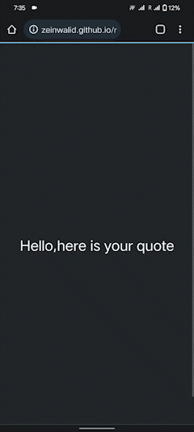

# random quote generator
<p align = "center">

</p>


<p>This app is built with HTML CSS JS <br> i used in this libraries : font-awesome and google fonts .   the heart of this app was Freecodecamp Api you can search i will tell you how to use it</p>

## how to use

```
 git clone https://github.com/zeinwalid/random-quote-generator.git
 ```


## wait for a new updates...

here is the <a href = "https://zeinwalid.github.io/random-quote-generator/">random quote generator</a>